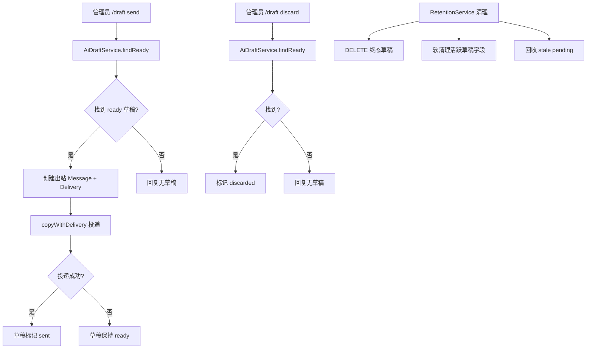

# AI Draft Lifecycle

Feature Name: ai-draft-lifecycle
Updated: 2026-06-29

## Description

补齐 AI 草稿的完整生命周期：新增 `/draft send`、`/draft discard`、`/draft view` 命令；草稿状态扩展 `sent` 和 `discarded`；草稿过期清理（混合策略：终态草稿硬删除，活跃草稿软清理）；stale pending 草稿回收；AI fetch 加 15 秒超时 + 1 次重试。草稿发送复用 Delivery 记录路径，享受投递重试 worker。

## Architecture



## Components and Interfaces

### 1. AiDraftService 新增方法

```typescript
export class AiDraftService {
  // 现有: generate

  async findReady(conversationId: number): Promise<DraftRow | undefined> {
    const row = this.db
      .prepare(
        `SELECT * FROM ai_drafts
         WHERE conversation_id = ? AND status = 'ready'
         ORDER BY created_at DESC LIMIT 1`,
      )
      .get(conversationId) as Record<string, unknown> | undefined;
    return row ? draftFromRow(row) : undefined;
  }

  async markSent(draftId: number): Promise<void> {
    this.db
      .prepare("UPDATE ai_drafts SET status = 'sent', updated_at = ? WHERE id = ?")
      .run(nowIso(), draftId);
  }

  async markDiscarded(draftId: number): Promise<void> {
    this.db
      .prepare("UPDATE ai_drafts SET status = 'discarded', updated_at = ? WHERE id = ?")
      .run(nowIso(), draftId);
  }
}
```

### 2. Draft 类型扩展

```typescript
export interface DraftRow {
  id: number;
  conversationId: number;
  sourceMessageId: number | null;
  status: "pending" | "ready" | "failed" | "sent" | "discarded";
  draftText: string | null;
  error: string | null;
  createdAt: string;
  updatedAt: string;
}
```

`schema.ts` 的 `Delivery.status` 无需变更（`sent` 和 `discarded` 是 ai_drafts 表的新值，不影响 deliveries 表）。

### 3. /draft 命令子命令路由

`commands.ts` 的 `case "draft"` 改为支持子命令：

```typescript
case "draft": {
  const subCommand = args.trim().split(/\s+/)[0]?.toLowerCase();
  if (subCommand === "send") {
    return handleDraftSend(ctx, deps, topic, conversation, contact);
  }
  if (subCommand === "discard") {
    return handleDraftDiscard(ctx, deps, conversation);
  }
  if (subCommand === "view") {
    return handleDraftView(ctx, deps, conversation);
  }
  // 无子命令：保持现有行为（重新生成）
  const result = await deps.aiDrafts.generate(conversation.id);
  // ... 现有逻辑
  return true;
}
```

### 4. handleDraftSend 实现

```typescript
async function handleDraftSend(
  ctx: Context,
  deps: CommandDeps & { deliveries: DeliveryService },
  topic: TelegramTopic,
  conversation: Conversation,
  contact: Contact,
): Promise<boolean> {
  const draft = await deps.aiDrafts.findReady(conversation.id);
  if (!draft) {
    await ctx.reply("当前没有可发送的草稿，使用 /draft 生成。");
    return true;
  }
  try {
    await sendOutboundMessage({
      ctx,
      deps,
      topic,
      conversation,
      contact,
      text: draft.draftText!,
    });
    await deps.aiDrafts.markSent(draft.id);
    await ctx.reply("草稿已发送给外部用户。");
  } catch (error) {
    const msg = error instanceof Error ? error.message : String(error);
    await ctx.reply(`草稿发送失败：${msg}。草稿保留，可重试 /draft send。`);
  }
  return true;
}
```

`sendOutboundMessage` 需要从 `messages.ts` 提取的共享投递逻辑。当前 `handleManagementMessage` 中普通文本回复的投递路径包含：创建出站 Message → createPending Delivery → copyWithDelivery → markSent/markFailed。需将这段逻辑提取为独立函数供 commands.ts 复用。

### 5. CommandDeps 扩展

`commands.ts` 的 `CommandDeps` 需要新增 `deliveries: DeliveryService` 和 `logger: Logger`（依赖稳定性地基的 logger 注入）：

```typescript
export interface CommandDeps {
  config: AppConfig;
  conversations: ConversationService;
  aiDrafts: AiDraftService;
  deliveries: DeliveryService;
  logger: Logger;
}
```

`bot.ts` 的 `createTelegramBot` 在构造 deps 时传入 `deliveries` 和 `logger`。`messages.ts` 的 `handleTopicCommand` 调用处也需传入更新后的 deps。

### 6. AI fetch 超时与重试

`ai-drafts.ts` 的 `generate` 方法中 fetch 调用改为：

```typescript
const startTime = Date.now();
let lastError: Error | undefined;
let attempts = 0;

while (attempts < 2) {
  attempts += 1;
  try {
    const response = await fetch(url, {
      method: "POST",
      headers: { ... },
      body: JSON.stringify({ ... }),
      signal: AbortSignal.timeout(15_000),
    });

    if (response.status >= 400 && response.status < 500) {
      // 4xx 不重试
      throw new Error(`AI provider returned HTTP ${response.status}`);
    }

    if (!response.ok) {
      throw new Error(`AI provider returned HTTP ${response.status}`);
    }

    // ... 解析响应
    const elapsed = Date.now() - startTime;
    logger.info({ draftId, attempts, elapsedMs: elapsed }, "AI draft generated.");
    // ... 更新为 ready
    return { status: "ready", text };
  } catch (error) {
    lastError = error instanceof Error ? error : new Error(String(error));
    if (attempts < 2) {
      await new Promise((resolve) => setTimeout(resolve, 2000));
    }
  }
}

// 重试耗尽
const message = lastError?.message ?? "AI draft generation failed.";
// ... 更新为 failed
return { status: "failed", error: message };
```

### 7. 草稿过期清理（RetentionService 扩展）

`retention.ts` 的 `cleanupExpired` 新增草稿清理逻辑：

```typescript
async cleanupExpired(): Promise<number> {
  let cleaned = 0;

  // 1. 回收 stale pending（超过 5 分钟）
  const staleCutoff = new Date(Date.now() - 5 * 60 * 1000).toISOString();
  const staleResult = this.db
    .prepare(
      `UPDATE ai_drafts
       SET status = 'failed', error = 'Draft generation timed out (process may have restarted)', updated_at = ?
       WHERE status = 'pending' AND created_at < ?`,
    )
    .run(nowIso(), staleCutoff);
  cleaned += staleResult.changes;

  // 2. 硬删除终态草稿（sent/discarded/failed 且超过保留期）
  const retentionCutoff = new Date(Date.now() - this.retentionDays * 86400 * 1000).toISOString();
  const deleted = this.db
    .prepare(
      `DELETE FROM ai_drafts
       WHERE status IN ('sent', 'discarded', 'failed') AND created_at < ?`,
    )
    .run(retentionCutoff);
  cleaned += deleted.changes;

  // 3. 软清理 ready/pending 草稿的文本字段（保留行用于审计）
  this.db
    .prepare(
      `UPDATE ai_drafts
       SET draft_text = NULL, error = NULL, updated_at = ?
       WHERE created_at < ? AND (draft_text IS NOT NULL OR error IS NOT NULL)`,
    )
    .run(nowIso(), retentionCutoff);

  // 4. 现有的消息正文清理...
  return cleaned;
}
```

### 8. 帮助文本更新

`commands.ts` 的 `topicHelpText` 中 `/draft` 行更新为：

```
/draft - 重新生成 AI 回复草稿
/draft view - 查看当前草稿
/draft send - 发送当前草稿给外部用户
/draft discard - 丢弃当前草稿
```

## Data Models

### ai_drafts 表 status 值扩展

| status | 含义 | 清理策略 |
|--------|------|----------|
| pending | 生成中 | 超过 5 分钟回收为 failed |
| ready | 可用 | 超过保留期软清理字段 |
| failed | 生成失败 | 超过保留期硬删除 |
| sent | 已发送 | 超过保留期硬删除 |
| discarded | 已丢弃 | 超过保留期硬删除 |

无需 schema 迁移：`status` 列已是 TEXT 类型，新增值不需要 ALTER TABLE。

## Correctness Properties

1. `/draft send` 必须复用 Delivery 记录路径，确保投递失败时有重试 worker 兜底。
2. 草稿发送成功后必须标记为 `sent`，防止重复发送。
3. 草稿发送失败时必须保持 `ready`，允许重试 `/draft send`。
4. `findReady` 必须按 `created_at DESC` 排序，返回最新的 ready 草稿。
5. stale pending 回收的 5 分钟阈值必须大于 AI fetch 的 15 秒超时 + 2 秒重试间隔，避免误回收正在生成中的草稿。
6. 草稿清理必须复用 `MESSAGE_RETENTION_SWEEP_INTERVAL_MINUTES` 间隔，不新增定时器。

## Error Handling

| 场景 | 处理 |
|------|------|
| `/draft send` 时外部用户 chatId 不可达 | Delivery 标记 failed，草稿保持 ready，回复管理员失败原因 |
| `/draft send` 时 bot.api 抛异常 | catch 后回复管理员，草稿保持 ready |
| AI fetch 超时 | 重试 1 次，仍失败则标记草稿 failed |
| AI fetch 4xx | 不重试，直接标记 failed |
| stale pending 回收时 DB 错误 | RetentionService 的调用方（main.ts 定时器）已 catch 并 logger.error |

## Test Strategy

### 单元测试

1. **findReady 返回最新 ready 草稿**：插入 3 条草稿（1 ready 旧 + 1 ready 新 + 1 sent），断言返回最新的 ready。
2. **markSent 更新状态**：插入 ready 草稿，调用 markSent，断言 status 变为 sent。
3. **markDiscarded 更新状态**：同上。
4. **cleanupExpired 回收 stale pending**：插入 pending 草稿，created_at 设为 6 分钟前，运行清理，断言变为 failed。
5. **cleanupExpired 硬删除终态草稿**：插入 sent 草稿，created_at 设为 31 天前，运行清理，断言行被删除。
6. **cleanupExpired 软清理 ready 草稿字段**：插入 ready 草稿，created_at 设为 31 天前，运行清理，断言 draft_text 变为 NULL 但行存在。
7. **AI fetch 超时后重试**：mock fetch 第一次 timeout，第二次成功，断言草稿为 ready 且 attempts=2。
8. **AI fetch 4xx 不重试**：mock fetch 返回 401，断言草稿为 failed 且 attempts=1。

### 验证命令

```bash
npm run verify
```

## References

[^1]: (src/domain/ai-drafts.ts#L19) - AiDraftService.generate 当前实现
[^2]: (src/domain/ai-drafts.ts#L45) - fetch 调用无超时
[^3]: (src/channels/telegram/commands.ts#L300) - /draft 命令当前实现
[^4]: (src/channels/telegram/messages.ts#L272) - 草稿生成后展示逻辑
[^5]: (src/domain/retention.ts) - RetentionService.cleanupExpired 当前实现
[^6]: (src/storage/migrations/0001_initial.ts#L96) - ai_drafts 表定义
[^7]: (src/domain/deliveries.ts#L24) - DeliveryService.createPending
[^8]: (src/channels/telegram/messages.ts#L88) - copyWithDelivery 投递逻辑
