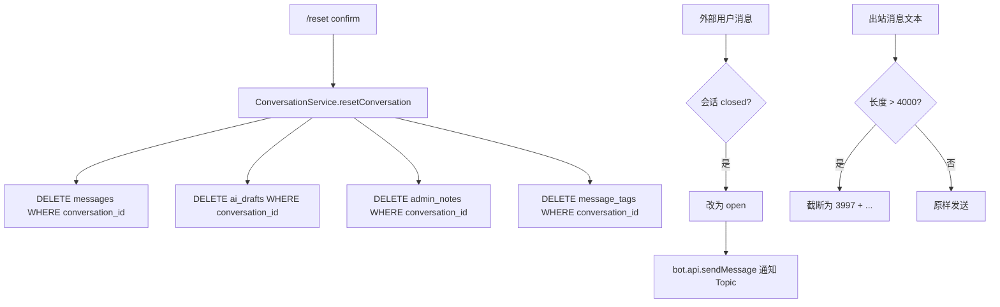

# Command and Message Refinement

Feature Name: command-message-refinement
Updated: 2026-06-29

## Description

补齐命令系统和消息流的缺口：新增 `/reset` 命令（清空会话数据但保留映射）；`/assign` 参数校验；未知命令加 `/help` 提示；命令菜单补齐 `/help` `/ai_on` `/ai_off`；closed 会话重开时发 bot 通知；出站消息和 AI 草稿超长自动截断；AI 上下文拼接加长度上限。

## Architecture



## Components and Interfaces

### 1. ConversationService.resetConversation

```typescript
async resetConversation(conversationId: number): Promise<void> {
  this.db.prepare("DELETE FROM messages WHERE conversation_id = ?").run(conversationId);
  this.db.prepare("DELETE FROM ai_drafts WHERE conversation_id = ?").run(conversationId);
  this.db.prepare("DELETE FROM admin_notes WHERE conversation_id = ?").run(conversationId);
  this.db.prepare("DELETE FROM message_tags WHERE conversation_id = ?").run(conversationId);
}
```

### 2. /reset 命令

```typescript
case "reset": {
  if (args !== "confirm") {
    await ctx.reply("危险操作：将清空当前会话的所有消息、草稿和备注。确认请发送 /reset confirm");
    return true;
  }
  await deps.conversations.resetConversation(conversation.id);
  await ctx.reply("会话已重置。联系人映射和 Topic 已保留。");
  return true;
}
```

### 3. /assign 参数校验

```typescript
case "assign": {
  if (!args) {
    await ctx.reply("用法：/assign <telegram_user_id>，ID 必须为数字。");
    return true;
  }
  if (!/^\d+$/.test(args)) {
    await ctx.reply("用法：/assign <telegram_user_id>，ID 必须为数字。");
    return true;
  }
  await deps.conversations.assign(conversation.id, args);
  await ctx.reply(`已分配给 ${args}。`);
  return true;
}
```

### 4. 未知命令提示

`messages.ts` 的 `handleManagementMessage` 中：

```typescript
if (text?.startsWith("/")) {
  const handled = await handleTopicCommand(ctx, deps, { topic, conversation, contact }, text);
  if (!handled) await ctx.reply("未知命令。发送 /help 查看可用命令列表。");
  return;
}
```

### 5. 命令菜单补齐

`menu.ts` 的 `adminBotCommands` 新增：

```typescript
{ command: "help", description: "查看可用命令列表" },
{ command: "ai_on", description: "开启当前会话的 AI 草稿" },
{ command: "ai_off", description: "关闭当前会话的 AI 草稿" },
{ command: "reset", description: "清空会话消息和草稿，需 /reset confirm" },
```

`privateBotCommands` 新增：

```typescript
{ command: "help", description: "查看使用帮助" },
```

### 6. Closed 会话重开通知

`messages.ts` 的 `handlePrivateMessage` 中，在 `setConversationStatus` 之后：

```typescript
if (bundle.conversation.status === "closed") {
  await deps.conversations.setConversationStatus(bundle.conversation.id, "open");
  const topic = await ensureTelegramTopic({ ... });
  try {
    await ctx.api.sendMessage(
      deps.config.TELEGRAM_MANAGEMENT_CHAT_ID,
      "会话已自动重开（用户发送了新消息）。",
      { message_thread_id: topic.messageThreadId },
    );
  } catch {
    // 通知失败不影响主流程
  }
}
```

注意：当前代码在 `setConversationStatus` 之后才 `ensureTelegramTopic`，需要调整顺序——先 ensure topic 再发通知。实际上 topic 已在后续代码中 ensure，只需将通知逻辑移到 topic ensure 之后。

### 7. 消息长度截断

新增工具函数：

```typescript
const MAX_MESSAGE_LENGTH = 4000;

function truncateText(text: string, max = MAX_MESSAGE_LENGTH): string {
  if (text.length <= max) return text;
  return text.slice(0, max - 3) + "...";
}
```

在 `handleManagementMessage` 的出站投递前调用：
```typescript
const truncatedText = text ? truncateText(text) : text;
// 使用 truncatedText 作为 fallbackText 和 text
```

在 `ai-drafts.ts` 的草稿生成后调用：
```typescript
const text = truncateText(rawText);
```

### 8. AI 上下文长度限制

`ai-drafts.ts` 的上下文拼接：

```typescript
const MAX_CONTEXT_LENGTH = 12000;

function buildContext(messages: Message[]): string {
  let context = "";
  for (let i = messages.length - 1; i >= 0; i--) {
    const line = `${messages[i].direction}: ${messages[i].text ?? `[${messages[i].messageType}]`}`;
    if (context.length + line.length + 1 > MAX_CONTEXT_LENGTH) break;
    context = line + "\n" + context;
  }
  return context;
}
```

### 9. 帮助文本更新

`commands.ts` 的 `topicHelpText` 新增：

```
/reset confirm - 清空会话消息和草稿，保留联系人映射和 Topic
```

## Data Models

无新增数据库表或列。`/reset` 通过 DELETE 操作清理现有表数据。

## Correctness Properties

1. `/reset confirm` 必须删除 4 张表的该会话数据，但保留 conversation、contact、telegram_topics 记录。
2. `/assign` 的正则校验必须只接受纯数字。
3. closed 重开通知必须在 topic ensure 之后发送，确保 message_thread_id 可用。
4. 消息截断必须在投递前执行，截断后的长度（含"..."）不超过 4000 字符。
5. AI 上下文构建从最新消息向前拼接，超限时丢弃最旧消息。

## Error Handling

| 场景 | 处理 |
|------|------|
| `/reset` 时 DB DELETE 失败 | 抛异常，grammy catch 捕获，管理员看到 bot.catch 的默认错误 |
| 重开通知 sendMessage 失败 | catch 吞错，不影响消息投递主流程 |
| 消息截断时 text 为 null | 不截断（null 表示无文本，如纯媒体消息） |

## Test Strategy

1. **resetConversation 清空 4 表**：插入消息+草稿+备注+标签，调用 resetConversation，断言 4 表为空但 conversation 存在。
2. **/assign 非数字拒绝**：发送 `/assign abc`，断言回复用法提示。
3. **/assign 数字成功**：发送 `/assign 123`，断言 assigned_admin_id 更新。
4. **未知命令提示 /help**：发送 `/foobar`，断言回复包含"/help"。
5. **truncateText 不超 4000**：传入 5000 字符，断言输出长度为 4000 且以"..."结尾。
6. **truncateText 短文本不变**：传入 100 字符，断言原样返回。
7. **buildContext 长度限制**：传入总长 15000 的消息数组，断言拼接结果不超过 12000。
8. **菜单包含新命令**：检查 adminBotCommands 包含 help/ai_on/ai_off/reset。

## References

[^1]: (src/channels/telegram/commands.ts#L251) - /assign 当前实现
[^2]: (src/channels/telegram/commands.ts#L279) - /close 当前实现
[^3]: (src/channels/telegram/messages.ts#L149) - closed 重开逻辑
[^4]: (src/channels/telegram/messages.ts#L309) - 未知命令处理
[^5]: (src/channels/telegram/menu.ts#L32) - adminBotCommands 数组
[^6]: (src/domain/ai-drafts.ts#L40) - AI 上下文拼接
[^7]: (src/domain/conversations.ts#L275) - deleteConversationData 参考
