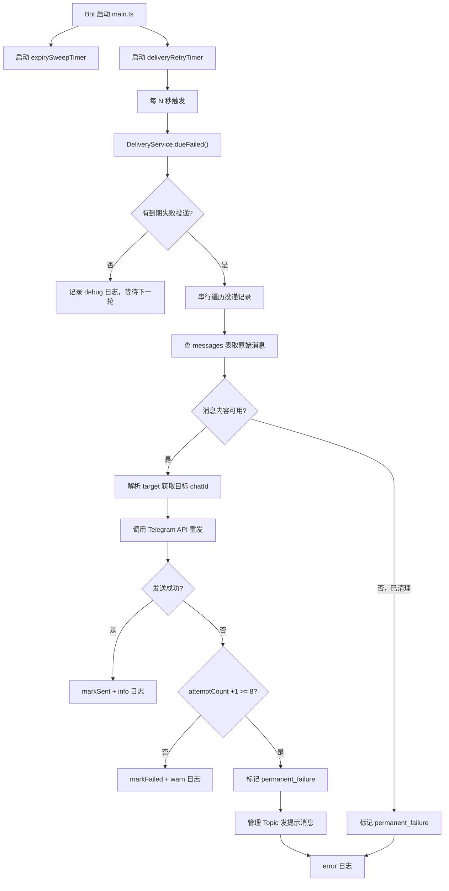

# Delivery Retry Worker

Feature Name: delivery-retry-worker
Updated: 2026-06-29

## Description

在 bot 运行时新增一个后台定时 worker，周期性消费 `deliveries` 表中状态为 `failed` 且 `next_retry_at` 到期的出站投递记录。Worker 通过 `source_message_id` 关联 `messages` 表获取原始消息，解析 `target` 字段定位 Telegram 目标，调用 grammy API 重新发送。达到最大重试次数（8 次）后标记为 `permanent_failure` 并在管理 Topic 通知管理员。

## Architecture



## Components and Interfaces

### 1. DeliveryService 扩展（`src/domain/deliveries.ts`）

新增 `markPermanentFailure` 方法和 `maxAttempts` 常量：

```typescript
export const MAX_DELIVERY_ATTEMPTS = 8;

export class DeliveryService {
  // 现有方法保持不变...

  async markPermanentFailure(deliveryId: number, error: string): Promise<void> {
    this.db
      .prepare(
        `UPDATE deliveries
         SET status = 'permanent_failure', last_error = ?, next_retry_at = NULL, updated_at = ?
         WHERE id = ?`,
      )
      .run(error, nowIso(), deliveryId);
  }
}
```

### 2. DeliveryRetryWorker（`src/domain/delivery-retry.ts`，新文件）

```typescript
export interface DeliveryRetryDeps {
  deliveries: DeliveryService;
  conversations: ConversationService;
  api: Bot["api"];
  logger: Logger;
  config: { DELIVERY_RETRY_INTERVAL_SECONDS: number };
}

export function startDeliveryRetryWorker(deps: DeliveryRetryDeps): () => void {
  // 返回 stop 函数，供 main.ts 在关闭时调用
}
```

### 3. 重发逻辑

Worker 需要根据 `target` 字段格式和原始消息类型决定重发方式：

- `target` 格式 `telegram-user:{userId}` → 出站到外部用户私聊
- `target` 格式 `telegram-topic:{threadId}` → 入站到管理 Topic（当前不存在此场景，但保留）

重发策略：
- 优先 `copyMessage`（保留媒体和格式）
- `copyMessage` 失败且 `messages.text` 存在时，降级 `sendMessage`
- 两者都失败则 `markFailed`

### 4. main.ts 集成

在 `restartRuntime` 中启动 worker，在 `stopRuntime` 中停止：

```typescript
let deliveryRetryStop: (() => void) | undefined;

function restartRuntime() {
  // ... 现有逻辑 ...
  deliveryRetryStop = startDeliveryRetryWorker({
    deliveries, conversations, api: bot.api, logger, config,
  });
}

function stopRuntime() {
  deliveryRetryStop?.();
  // ... 现有逻辑 ...
}
```

## Data Models

### deliveries 表新增状态值

现有 `status` 枚举：`pending` | `sent` | `failed`

新增：`permanent_failure`

无需 schema 变更（`status` 是 TEXT，无 CHECK 约束）。

### target 字段解析

```typescript
function parseDeliveryTarget(target: string): { chatId: number; threadId?: number } {
  // "telegram-user:123456789" → { chatId: 123456789 }
  // "telegram-topic:123" → { chatId: managementChatId, threadId: 123 }
}
```

`telegram-topic` 场景需要管理群 ID，从配置 `TELEGRAM_MANAGEMENT_CHAT_ID` 获取。

## Correctness Properties

1. **串行处理**：同一时间只有一个 worker 轮次在运行，避免重复投递
2. **幂等性**：`markSent` 和 `markFailed` 基于 deliveryId 更新，重复调用不会产生副作用
3. **退避单调递增**：每次 `markFailed` 的 `nextRetryAt` 严格大于上一次
4. **永久失败终态**：`permanent_failure` 状态的投递不会被 `dueFailed` 再次选中
5. **消息清理安全**：原始消息已被 retention 清理时，不尝试重发，直接永久失败
6. **进程退出安全**：stop 函数清除定时器，正在处理的投递完成当前记录后自然结束

## Error Handling

| 场景 | 处理 |
|------|------|
| `source_message_id` 为 NULL | 记录 warn 日志，标记 permanent_failure |
| messages 记录不存在 | 记录 warn 日志，标记 permanent_failure |
| messages.text 和 raw_payload 均为 NULL | 标记 permanent_failure（已被 retention 清理） |
| `external_message_id` 为 NULL | 标记 permanent_failure（无法定位原消息） |
| Telegram API 返回 429 (rate limit) | markFailed，由退避机制处理 |
| Telegram API 返回 403 (blocked) | 标记 permanent_failure（用户已封禁 bot） |
| Telegram API 返回 thread not found | 标记 permanent_failure（Topic 已删） |
| 管理 Topic 提示发送失败 | 仅记录 error 日志，不影响投递状态 |
| Worker 单轮内某条记录抛异常 | 捕获并记录，继续处理下一条，不影响其他投递 |

## Test Strategy

### 单元测试（`test/delivery-retry.test.ts`，新增）

1. **dueFailed 为空时跳过处理**：无到期投递时，不调用任何 API
2. **成功重发**：创建 failed delivery + 有效 message，worker 成功重发后 status 变为 sent
3. **重发失败递增 attemptCount**：copyMessage 抛错，markFailed 被调用，attemptCount +1
4. **达到上限标记永久失败**：attemptCount=7 时重发失败，标记 permanent_failure
5. **消息已清理时永久失败**：messages.text 和 raw_payload 为 NULL，直接永久失败
6. **permanent_failure 发送 Topic 提示**：永久失败后在管理群 Topic 发送提示消息
7. **串行处理**：多条 dueFailed 按顺序处理，不并发
8. **stop 函数清除定时器**：调用 stop 后不再触发新一轮扫描

### 集成验证

- `npm run verify` 通过
- 现有 25 个测试不受影响

## References

[^1]: (src/domain/deliveries.ts#L40-L49) - `markFailed` 现有实现，含指数退避计算
[^2]: (src/domain/deliveries.ts#L51-L56) - `dueFailed` 查询已实现
[^3]: (src/channels/telegram/messages.ts#L73-L127) - 现有同步投递流程，含 copyMessage + 降级
[^4]: (src/runtime/main.ts) - 现有 expirySweepTimer 模式，worker 复用此结构
[^5]: (src/storage/migrations/0001_initial.ts#L56-L67) - deliveries 表结构
