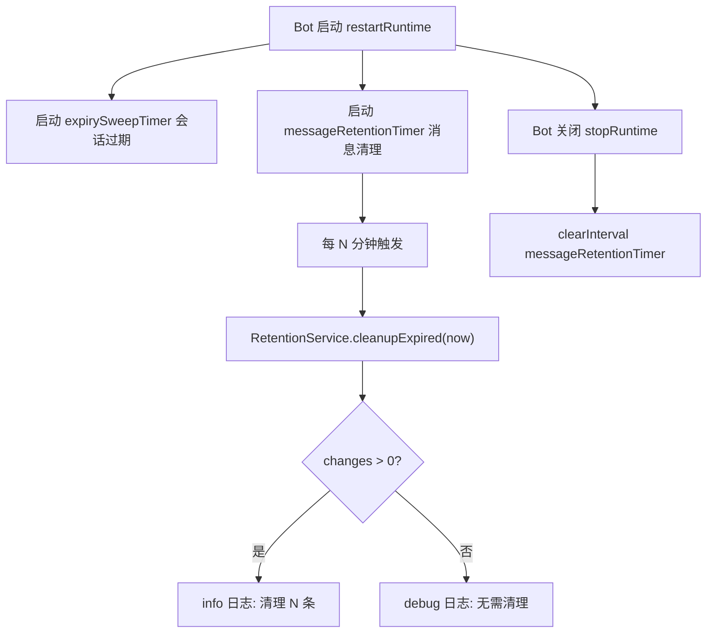

# Message Retention Timer

Feature Name: message-retention-timer
Updated: 2026-06-29

## Description

在 bot 运行时新增一个独立定时器，周期性调用已有的 `RetentionService.cleanupExpired`，将 `messages` 表中 `expires_at` 到期的行 `text` 和 `raw_payload` 置 NULL。复用现有 `expirySweepTimer` 的启动/停止模式，但使用独立的定时器变量和配置项。

## Architecture



## Components and Interfaces

### 1. 配置项新增（`src/runtime/config.ts`）

在 `databaseConfigSchema` 和 `editableConfigKeys` 中新增：

```typescript
MESSAGE_RETENTION_SWEEP_INTERVAL_MINUTES: z.coerce.number().int().positive().default(60),
```

加入 `editableConfigKeys` 数组，使其可在 Web 控制台配置。

### 2. main.ts 集成

```typescript
let messageRetentionTimer: NodeJS.Timeout | undefined;

function runMessageRetentionSweep(): Promise<void> {
  const retention = new RetentionService(handle);
  const cleaned = await retention.cleanupExpired();
  if (cleaned > 0) {
    logger.info({ cleaned }, "Message retention sweep cleaned expired message content.");
  } else {
    logger.debug("Message retention sweep found nothing to clean.");
  }
}

// 在 restartRuntime 中：
void runMessageRetentionSweep().catch(/* ... */);
messageRetentionTimer = setInterval(
  () => void runMessageRetentionSweep().catch(/* ... */),
  config.MESSAGE_RETENTION_SWEEP_INTERVAL_MINUTES * 60 * 1000,
);

// 在 stopRuntime 中：
if (messageRetentionTimer) clearInterval(messageRetentionTimer);
messageRetentionTimer = undefined;
```

### 3. Web 控制台配置项（`src/runtime/web-console.ts`）

在 `fieldGroups` 的"数据保留与自动清理"分组中新增字段：

```typescript
{
  key: "MESSAGE_RETENTION_SWEEP_INTERVAL_MINUTES",
  label: "消息正文清理扫描间隔",
  note: "运行中的 bot 每隔多少分钟清理一次过期的消息正文和 raw payload。保留会话映射与 Topic。",
  placeholder: "默认：60",
  inputMode: "numeric",
},
```

## Data Models

无 schema 变更。`messages` 表已有 `expires_at` 字段和 `messages_expires_idx` 索引。

## Correctness Properties

1. **独立运行**：消息清理定时器与会话过期定时器互不影响，各自独立的 `NodeJS.Timeout` 句柄
2. **幂等性**：`cleanupExpired` 的 UPDATE 带条件 `raw_payload IS NOT NULL OR text IS NOT NULL`，重复调用无副作用
3. **行级安全**：只看 `expires_at` 字段，不依赖会话状态，已删除会话的孤儿消息行（如有）也会被清理
4. **元数据保留**：只清理 `text` 和 `raw_payload`，`external_message_id`、`direction`、`message_type`、`created_at` 等元数据保留
5. **配置热更新**：`restartRuntime` 时旧定时器被清除，新定时器用新配置值创建

## Error Handling

| 场景 | 处理 |
|------|------|
| SQLite 查询失败 | 捕获并记录 error 日志，不影响下一轮 |
| `cleanupExpired` 抛异常 | 捕获并记录，定时器继续运行 |
| 配置值非法（已被 zod 拦截） | 不可能进入运行时，zod 在 loadConfig 阶段拒绝 |

## Test Strategy

### 单元测试（`test/retention-timer.test.ts`，新增）

1. **cleanupExpired 清理到期消息**：插入 `expires_at` 过去的消息，调用后 `text` 和 `raw_payload` 为 NULL
2. **未到期消息不受影响**：插入 `expires_at` 未来的消息，调用后内容保留
3. **已清理消息不重复处理**：`text` 和 `raw_payload` 已为 NULL 的行，`changes` 返回 0
4. **保留元数据**：清理后 `external_message_id`、`direction`、`message_type` 仍存在
5. **返回清理行数**：插入 3 条到期消息，返回值为 3

现有 `test/core.test.ts` 已有 retention 相关测试（conversations suite 的 "cleans expired message content while preserving rows"），可补充定时器集成测试。

### 集成验证

- `npm run verify` 通过
- Web 控制台显示新配置项

## References

[^1]: (src/domain/retention.ts) - `RetentionService.cleanupExpired` 完整实现
[^2]: (src/runtime/main.ts#L74-L81) - `expirySweepTimer` 模式，本功能复用
[^3]: (src/tools/retention-cleanup.ts) - 现有 CLI 调用方式
[^4]: (src/runtime/config.ts#L44) - `CONVERSATION_EXPIRY_SWEEP_INTERVAL_MINUTES` 配置定义模式
