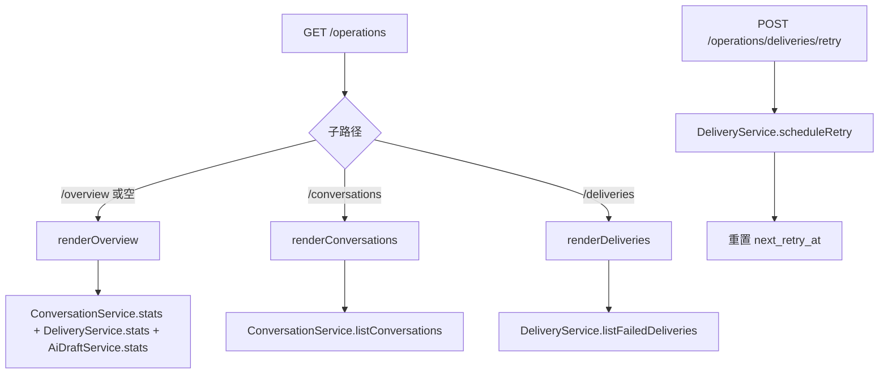

# Operations Dashboard

Feature Name: operations-dashboard
Updated: 2026-06-29

## Description

在 Web 控制台新增运维视图区域，采用独立仪表盘风格（更宽向的卡片、数据表格、筛选器、图表元素）。包含三个页面：统计概览（`/operations/overview`）、会话列表（`/operations/conversations`）、失败投递队列（`/operations/deliveries`）。运维页面与配置页面共享认证和布局壳，但使用独立的仪表盘 CSS 命名空间。失败投递支持手动重置重试时间（permanent_failure 不可重试）。

## Architecture



## Components and Interfaces

### 1. 路由层扩展（web-console.ts）

在 session 认证之后新增运维路由组：

```typescript
if (url.pathname === "/operations" || url.pathname === "/operations/overview") {
  const data = options.collectOperationsOverview();
  renderOperationsOverview(res, data, url.searchParams.get("action") === "retryed");
  return;
}

if (url.pathname === "/operations/conversations") {
  const page = Math.max(1, Number(url.searchParams.get("page") ?? "1"));
  const status = url.searchParams.get("status") ?? undefined;
  const data = options.listConversations({ page, status, pageSize: 50 });
  renderConversations(res, data, page, status);
  return;
}

if (url.pathname === "/operations/deliveries") {
  const page = Math.max(1, Number(url.searchParams.get("page") ?? "1"));
  const data = options.listFailedDeliveries({ page, pageSize: 50 });
  renderDeliveries(res, data, page);
  return;
}

if (url.pathname === "/operations/deliveries/retry" && req.method === "POST") {
  const form = await readForm(req);
  const deliveryId = Number(form.get("delivery_id"));
  await options.scheduleRetry(deliveryId);
  redirect(res, "/operations/deliveries?action=retryed");
  return;
}
```

### 2. WebConsoleOptions 扩展

```typescript
interface WebConsoleOptions {
  // 现有字段...
  collectOperationsOverview: () => OperationsOverview;
  listConversations: (opts: { page: number; status?: string; pageSize: number }) => ConversationListResult;
  listFailedDeliveries: (opts: { page: number; pageSize: number }) => DeliveryListResult;
  scheduleRetry: (deliveryId: number) => Promise<void>;
}
```

### 3. Domain Service 新增方法

**ConversationService.listConversations**：
```typescript
async listConversations(opts: {
  status?: "open" | "closed";
  limit: number;
  offset: number;
}): Promise<{ items: ConversationListItem[]; total: number }> {
  const where = opts.status ? "WHERE c.status = ?" : "";
  const params = opts.status ? [opts.status] : [];
  const rows = this.db
    .prepare(
      `SELECT c.*, ct.display_name, ct.username, t.topic_name, t.message_thread_id
       FROM conversations c
       LEFT JOIN contacts ct ON c.contact_id = ct.id
       LEFT JOIN telegram_topics t ON t.conversation_id = c.id
       ${where}
       ORDER BY c.last_message_at DESC NULLS LAST
       LIMIT ? OFFSET ?`,
    )
    .all(...params, opts.limit, opts.offset) as Record<string, unknown>[];
  const countRow = this.db
    .prepare(`SELECT COUNT(*) AS cnt FROM conversations c ${where}`)
    .get(...params) as { cnt: number };
  return { items: rows.map(conversationListItemFromRow), total: countRow.cnt };
}
```

**DeliveryService.listFailedDeliveries**：
```typescript
async listFailedDeliveries(opts: {
  limit: number;
  offset: number;
}): Promise<{ items: Delivery[]; total: number }> {
  const rows = this.db
    .prepare(
      `SELECT * FROM deliveries
       WHERE status IN ('failed', 'permanent_failure')
       ORDER BY created_at ASC
       LIMIT ? OFFSET ?`,
    )
    .all(opts.limit, opts.offset) as Record<string, unknown>[];
  const countRow = this.db
    .prepare(`SELECT COUNT(*) AS cnt FROM deliveries WHERE status IN ('failed', 'permanent_failure')`)
    .get() as { cnt: number };
  return { items: rows.map(deliveryFromRow), total: countRow.cnt };
}
```

**DeliveryService.scheduleRetry**：
```typescript
async scheduleRetry(deliveryId: number): Promise<void> {
  this.db
    .prepare(
      `UPDATE deliveries
       SET next_retry_at = ?, updated_at = ?
       WHERE id = ? AND status = 'failed'`,
    )
    .run(nowIso(), nowIso(), deliveryId);
}
```

注意 `WHERE status = 'failed'` 确保 permanent_failure 不可重试。

### 4. 仪表盘 CSS 命名空间

运维页面使用 `ops-` 前缀的 CSS 类名，与配置页的样式隔离。在 `page()` 函数中根据页面类型注入不同的 CSS：

```typescript
function opsPage(title: string, body: string, activeNav: "overview" | "conversations" | "deliveries"): string {
  return `<!DOCTYPE html><html lang="zh-CN" data-theme="...">
  <head>...<style>${baseCss}${opsCss}</style>...</head>
  <body>
    <header class="ops-header">
      <a href="/">配置</a>
      <a href="/operations" class="${activeNav === 'overview' ? 'active' : ''}">概览</a>
      <a href="/operations/conversations" class="${activeNav === 'conversations' ? 'active' : ''}">会话</a>
      <a href="/operations/deliveries" class="${activeNav === 'deliveries' ? 'active' : ''}">投递</a>
    </header>
    <main class="ops-main">${body}</main>
  </body></html>`;
}
```

### 5. 概览页渲染

```typescript
function renderOperationsOverview(res, data: OperationsOverview, showRetryBanner: boolean): void {
  const cards = [
    statCard("消息总量", [
      metric("入站", data.messages.inboundTotal),
      metric("出站", data.messages.outboundTotal),
    ]),
    statCard("投递状态", [
      metric("pending", data.deliveries.pending, "warn"),
      metric("sent", data.deliveries.sent, "ok"),
      metric("failed", data.deliveries.failed, data.deliveries.failed > 0 ? "danger" : "neutral"),
      metric("permanent_failure", data.deliveries.permanentFailure, data.deliveries.permanentFailure > 0 ? "danger" : "neutral"),
    ]),
    statCard("会话", [
      metric("open", data.conversations.open, "ok"),
      metric("closed", data.conversations.closed),
    ]),
    statCard("AI 草稿", [
      metric("pending", data.aiDrafts.pending),
      metric("ready", data.aiDrafts.ready, "ok"),
      metric("failed", data.aiDrafts.failed),
      metric("sent", data.aiDrafts.sent),
      metric("discarded", data.aiDrafts.discarded),
    ]),
  ];
  // ... HTML 渲染
}
```

### 6. 会话列表渲染

表格形式，列：Topic 名称、联系人、状态（badge）、优先级（badge）、负责人、最后消息时间、创建时间。底部分页导航。

### 7. 投递队列渲染

表格形式，列：ID、目标、状态（badge）、尝试次数（x/8）、最后错误（截断）、创建时间、下次重试时间、操作（重试按钮，仅 failed 显示）。

重试按钮为内联 form：
```html
<form method="post" action="/operations/deliveries/retry" style="display:inline">
  <input type="hidden" name="delivery_id" value="${delivery.id}">
  <button type="submit" class="ops-btn-retry">重试</button>
</form>
```

## Data Models

### OperationsOverview

```typescript
interface OperationsOverview {
  messages: { inboundTotal: number; outboundTotal: number; internalTotal: number };
  deliveries: { pending: number; sent: number; failed: number; permanentFailure: number };
  conversations: { open: number; closed: number };
  aiDrafts: { pending: number; ready: number; failed: number; sent: number; discarded: number };
  uptimeSeconds: number;
}
```

### ConversationListItem

```typescript
interface ConversationListItem {
  id: number;
  status: "open" | "closed";
  priority: "low" | "normal" | "high" | "urgent";
  assignedAdminId: string | null;
  createdAt: string;
  lastMessageAt: string | null;
  contactDisplayName: string | null;
  contactUsername: string | null;
  topicName: string | null;
  messageThreadId: number | null;
}
```

## Correctness Properties

1. `scheduleRetry` 必须包含 `WHERE status = 'failed'` 条件，permanent_failure 不可重试。
2. 分页参数必须做下界校验（page >= 1），避免负 OFFSET。
3. 会话列表必须 LEFT JOIN contacts 和 telegram_topics，确保即使关联数据缺失也能显示会话。
4. 运维页面必须在 session 认证之后，未认证用户重定向到 /login。
5. `listConversations` 的排序必须使用 `last_message_at DESC NULLS LAST`，确保无消息的会话排在最后。

## Error Handling

| 场景 | 处理 |
|------|------|
| collectOperationsOverview 查询失败 | 抛异常，web-console 的 try/catch 返回 500 |
| listConversations 分页参数非法 | page 强制 >= 1，offset = (page-1)*pageSize |
| scheduleRetry 的 deliveryId 不存在 | UPDATE 影响 0 行，不报错，重定向后列表不变 |
| scheduleRetry 的 delivery 已是 permanent_failure | WHERE 条件过滤，0 行更新，不报错 |

## Test Strategy

1. **未认证访问 /operations 重定向 /login**：不带 cookie 请求，断言 302。
2. **概览页返回统计卡片**：带 cookie 请求，断言 HTML 包含 "消息总量"、"投递状态" 等。
3. **会话列表分页**：插入 55 条会话，请求 page=2，断言返回 5 条。
4. **会话列表状态筛选**：插入 open 和 closed 会话，请求 status=closed，断言只返回 closed。
5. **投递队列只返回 failed 和 permanent_failure**：插入各状态投递，断言列表只有 failed 和 permanent_failure。
6. **scheduleRetry 重置 next_retry_at**：插入 failed 投递，调用 scheduleRetry，断言 next_retry_at 更新。
7. **scheduleRetry 对 permanent_failure 无效**：插入 permanent_failure 投递，调用 scheduleRetry，断言 next_retry_at 不变。

## References

[^1]: (src/runtime/web-console.ts#L194) - startWebConsole 路由入口
[^2]: (src/runtime/web-console.ts#L303) - renderDashboard 当前实现
[^3]: (src/domain/conversations.ts#L110) - ConversationService 类
[^4]: (src/domain/deliveries.ts#L21) - DeliveryService 类
[^5]: (src/runtime/main.ts#L182) - startWebConsole 调用处
