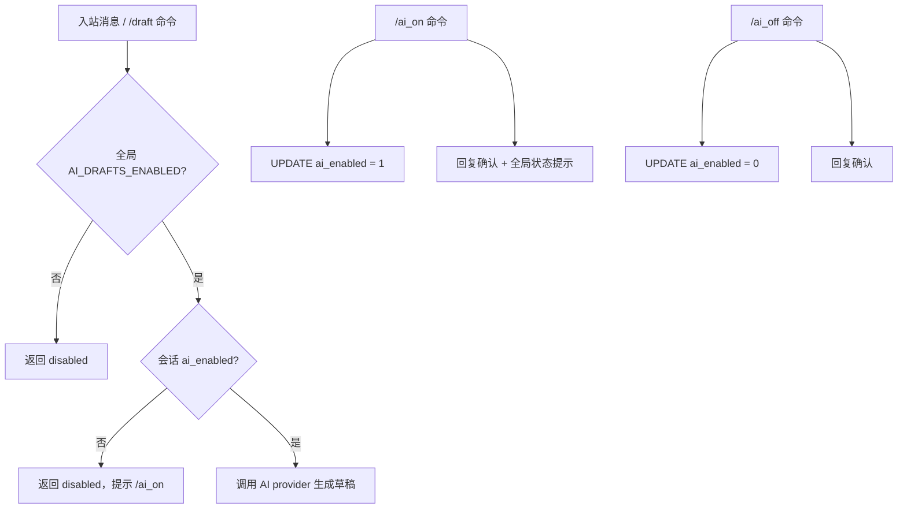

# Per-Conversation AI Toggle

Feature Name: per-conversation-ai-toggle
Updated: 2026-06-29

## Description

在 `conversations` 表新增 `ai_enabled` 列（默认 1），实装 `/ai_on` `/ai_off` 命令切换该字段。`AiDraftService.generate` 在全局开关通过后增加会话级开关检查。`/info` 和 `/status` 命令输出中展示 AI 开关状态。

## Architecture



## Components and Interfaces

### 1. 数据库迁移（`src/storage/migrations/0001_initial.ts`）

在迁移语句中新增列（利用现有 `addColumnIfMissing` 机制）：

```typescript
addColumnIfMissing(db, "conversations", "ai_enabled", "INTEGER NOT NULL DEFAULT 1");
```

同时新增 `0002_conversation_ai_enabled.ts` 迁移文件，或在现有幂等迁移中追加。考虑到现有迁移是单文件幂等模式（`CREATE TABLE IF NOT EXISTS` + `addColumnIfMissing`），在 `0001_initial.ts` 的语句数组中追加即可。

### 2. ConversationService 扩展（`src/domain/conversations.ts`）

```typescript
async setAiEnabled(conversationId: number, enabled: boolean): Promise<void> {
  this.db
    .prepare("UPDATE conversations SET ai_enabled = ?, updated_at = ? WHERE id = ?")
    .run(enabled ? 1 : 0, nowIso(), conversationId);
}

async getAiEnabled(conversationId: number): Promise<boolean> {
  const row = this.db
    .prepare("SELECT ai_enabled FROM conversations WHERE id = ?")
    .get(conversationId) as { ai_enabled: number } | undefined;
  return row ? Boolean(row.ai_enabled) : true;
}
```

`conversationFromRow` 解析函数中新增 `aiEnabled: Boolean(row.ai_enabled)`。

### 3. AiDraftService 扩展（`src/domain/ai-drafts.ts`）

在 `generate` 方法的 `isAiConfigured` 检查后增加会话级检查：

```typescript
async generate(conversationId: number, sourceMessageId?: number): Promise<DraftResult> {
  if (!isAiConfigured(this.config)) {
    return { status: "disabled", error: "AI drafts are not configured." };
  }

  const aiEnabled = await this.conversations.getAiEnabled(conversationId);
  if (!aiEnabled) {
    return { status: "disabled", error: "AI drafts are disabled for this conversation." };
  }

  // ... 现有生成逻辑 ...
}
```

### 4. 命令实装（`src/channels/telegram/commands.ts`）

替换现有占位：

```typescript
case "ai_on": {
  await deps.conversations.setAiEnabled(conversation.id, true);
  const globalEnabled = isAiConfigured(deps.config);
  const hint = globalEnabled ? "" : "\n\n提示：全局 AI 未开启，需先在控制台启用 AI_DRAFTS_ENABLED。";
  await ctx.reply(`已对该会话开启 AI 草稿。${hint}`);
  return true;
}
case "ai_off": {
  await deps.conversations.setAiEnabled(conversation.id, false);
  await ctx.reply("已对该会话关闭 AI 草稿。该会话不再自动生成回复草稿。");
  return true;
}
```

### 5. /info 和 /status 输出扩展

在 `commands.ts` 的 `/info` 和 `/status` 分支中，输出中增加 `AI 草稿：开启/关闭` 行。

### 6. createMessage 默认值

`getOrCreateConversation` 创建新会话时，依赖数据库 DEFAULT 1，无需显式设置。

## Data Models

### conversations 表变更

新增列：`ai_enabled INTEGER NOT NULL DEFAULT 1`

### Conversation 类型扩展（`src/storage/schema.ts` 或 conversations.ts）

```typescript
interface Conversation {
  // ... 现有字段 ...
  aiEnabled: boolean;
}
```

## Correctness Properties

1. **两级开关**：全局开关为 false 时，会话级开关无效，草稿不生成
2. **默认开启**：新会话 `ai_enabled` 默认 1，不破坏现有行为
3. **持久化**：开关状态存 DB，重启后保留
4. **命令幂等**：`/ai_on` 对已开启的会话无副作用，`/ai_off` 对已关闭的会话无副作用
5. **不影响草稿表**：开关关闭时直接返回 disabled，不往 `ai_drafts` 表写 pending 记录

## Error Handling

| 场景 | 处理 |
|------|------|
| `getAiEnabled` 查不到会话 | 返回 true（默认开启），不阻断流程 |
| `setAiEnabled` 更新 0 行 | 记录 warn 日志，命令仍回复确认 |
| 全局 AI 未配置时 `/ai_on` | 仍设置会话级开关，但提示需先启用全局 |

## Test Strategy

### 单元测试（`test/ai-toggle.test.ts`，新增）

1. **新会话默认开启**：创建会话后 `getAiEnabled` 返回 true
2. **/ai_off 关闭后 getAiEnabled 返回 false**：`setAiEnabled(id, false)` 后查询为 false
3. **/ai_on 重新开启**：`setAiEnabled(id, false)` 再 `setAiEnabled(id, true)` 后为 true
4. **会话级关闭时 generate 返回 disabled**：`ai_enabled=0` 时 `generate` 返回 `{status:"disabled"}`，不写 ai_drafts 表
5. **会话级开启时 generate 正常**：`ai_enabled=1` 且全局配置时正常生成
6. **全局关闭时忽略会话级**：全局 `AI_DRAFTS_ENABLED=false` 时，会话级无论开否都返回 disabled
7. **持久化**：关闭后重新查询会话，状态仍为关闭

### 集成验证

- `npm run verify` 通过
- `addColumnIfMissing` 在已有数据库上执行不报错

## References

[^1]: (src/domain/ai-drafts.ts#L19-L22) - `generate` 现有全局开关检查
[^2]: (src/channels/telegram/commands.ts#L316-L320) - `/ai_on` `/ai_off` 占位实现
[^3]: (src/channels/telegram/messages.ts#L272) - 入站消息自动生成草稿
[^4]: (src/domain/conversations.ts#L195) - `setConversationRetention` 模式，`setAiEnabled` 复用
[^5]: (src/storage/migrations/0001_initial.ts) - `addColumnIfMissing` 幂等迁移机制
