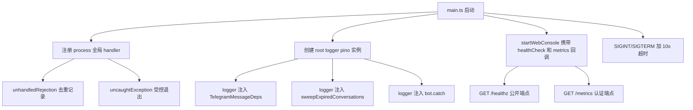

# Stability Foundation

Feature Name: stability-foundation
Updated: 2026-06-29

## Description

补齐 InboxBridge 的三个稳定性基础设施：(1) 全局未捕获异常和 Promise rejection 兜底；(2) 将 13 处 `console.error`/`console.log` 热路径调用统一为 pino 结构化日志；(3) 在 Web 控制台新增 `/healthz` 和 `/metrics` HTTP 端点。同时为 SIGINT/SIGTERM 优雅关闭增加 10 秒超时保护。

## Architecture



全局 handler 和 logger 在 `main.ts` 顶部注册，logger 通过现有的 deps 注入链路传递给消息处理、定时器和 grammy catch。健康检查和 metrics 端点复用 `startWebConsole` 的 server 实例，在路由层新增两个 path。

## Components and Interfaces

### 1. 全局异常 handler（main.ts）

在 `main.ts` 模块顶层、`startWebConsole` 调用之前注册：

```typescript
const rejectionWindow = new Map<string, { count: number; firstAt: number }>();
const REJECTION_DEDUP_WINDOW_MS = 60_000;
const REJECTION_DEDUP_THRESHOLD = 5;

process.on("unhandledRejection", (reason) => {
  const key = reason instanceof Error ? reason.message : String(reason);
  const now = Date.now();
  const entry = rejectionWindow.get(key);
  if (entry) {
    entry.count += 1;
    if (entry.count > REJECTION_DEDUP_THRESHOLD && now - entry.firstAt < REJECTION_DEDUP_WINDOW_MS) {
      return;
    }
  } else {
    rejectionWindow.set(key, { count: 1, firstAt: now });
  }
  if (entry && entry.count === REJECTION_DEDUP_THRESHOLD) {
    logger.warn({ key, count: entry.count }, "Unhandled rejection repeated; suppressing further logs for 60s.");
  } else {
    logger.error({ reason }, "Unhandled promise rejection.");
  }
  cleanupRejectionWindow(now);
});
```

`uncaughtException` handler：
```typescript
let shuttingDown = false;
process.on("uncaughtException", (error) => {
  logger.fatal({ error }, "Uncaught exception; initiating controlled shutdown.");
  if (shuttingDown) return;
  shuttingDown = true;
  void stopRuntime()
    .catch(() => {})
    .finally(() => {
      handle.client.close();
      process.exit(1);
    });
  setTimeout(() => {
    logger.warn("Graceful shutdown timed out after 10s; forcing exit.");
    handle.client.close();
    process.exit(1);
  }, 10_000).unref();
});
```

### 2. Logger 依赖注入

**TelegramMessageDeps** 新增 `logger: Logger` 字段：

```typescript
export interface TelegramMessageDeps {
  config: AppConfig;
  conversations: ConversationService;
  deliveries: DeliveryService;
  permissions: PermissionService;
  rateLimit: RateLimitService;
  aiDrafts: AiDraftService;
  logger: Logger;
}
```

`bot.ts` 的 `createTelegramBot` 签名新增 `logger` 参数，从 `main.ts` 传入根 logger 的 child：

```typescript
export function createTelegramBot(config: AppConfig, db: Database, logger: Logger): Bot {
  const deps = {
    // ...
    logger: logger.child({ module: "telegram.messages" }),
  };
  registerTelegramUpdates(bot, deps);
  return bot;
}
```

`registerTelegramUpdates` 内部的 `bot.catch` 改用 deps.logger：

```typescript
bot.catch((error) => {
  deps.logger.error(
    { updateId: error.ctx.update.update_id, err: error.error },
    "Telegram update processing failed.",
  );
});
```

### 3. sweepExpiredConversations 日志注入

`sweepExpiredConversations` 的 input 接口新增 `logger: Logger`：

```typescript
export async function sweepExpiredConversations(input: {
  api: Api;
  db: Database;
  messageRetentionDays: number;
  defaultConversationRetentionDays: number | null;
  logger: Logger;
}): Promise<number> {
```

`main.ts` 调用处传入 `logger.child({ module: "conversation-expiry" })`。

### 4. /healthz 端点

在 `web-console.ts` 的路由层，**在 session 认证检查之前**（公开端点）新增：

```typescript
if (url.pathname === "/healthz" && req.method === "GET") {
  const dbReachable = checkDbReachable();
  const botRunning = options.getStatus().bot === "running";
  const healthy = dbReachable && botRunning;
  res.statusCode = healthy ? 200 : 503;
  send(res, healthy ? 200 : 503, "application/json", JSON.stringify({
    status: healthy ? "ok" : "degraded",
    bot: botRunning ? "running" : "stopped",
    db: dbReachable ? "reachable" : "unreachable",
    uptime_seconds: Math.round(process.uptime()),
    timestamp: new Date().toISOString(),
  }));
  return;
}
```

`checkDbReachable` 通过 `options.dbHealthCheck()` 回调执行 `SELECT 1`。`WebConsoleOptions` 新增 `dbHealthCheck: () => boolean` 字段。

### 5. /metrics 端点

在 session 认证检查**之后**（需认证）新增：

```typescript
if (url.pathname === "/metrics" && req.method === "GET") {
  try {
    const metrics = options.collectMetrics();
    send(res, 200, "application/json", JSON.stringify(metrics));
  } catch (error) {
    send(res, 500, "application/json", JSON.stringify({ error: "metrics query failed" }));
  }
  return;
}
```

`WebConsoleOptions` 新增 `collectMetrics: () => MetricsSnapshot` 回调。`MetricsSnapshot` 类型：

```typescript
interface MetricsSnapshot {
  messages: {
    inbound_total: number;
    outbound_total: number;
    internal_total: number;
    pending_deliveries: number;
    failed_deliveries: number;
    permanent_failure_deliveries: number;
  };
  conversations: {
    active_total: number;
    closed_total: number;
  };
  ai_drafts: {
    pending_total: number;
    ready_total: number;
    failed_total: number;
  };
  uptime_seconds: number;
  timestamp: string;
}
```

### 6. Domain Service stats 方法

**DeliveryService** 新增：
```typescript
async stats(): Promise<{
  pending: number; sent: number; failed: number; permanentFailure: number;
}> {
  const rows = this.db
    .prepare("SELECT status, COUNT(*) AS cnt FROM deliveries GROUP BY status")
    .all() as Array<{ status: string; cnt: number }>;
  // 聚合为对象
}
```

**ConversationService** 新增：
```typescript
async stats(): Promise<{ open: number; closed: number }> {
  const rows = this.db
    .prepare("SELECT status, COUNT(*) AS cnt FROM conversations GROUP BY status")
    .all() as Array<{ status: string; cnt: number }>;
}
```

**AiDraftService** 新增：
```typescript
async stats(): Promise<{ pending: number; ready: number; failed: number }> {
  const rows = this.db
    .prepare("SELECT status, COUNT(*) AS cnt FROM ai_drafts GROUP BY status")
    .all() as Array<{ status: string; cnt: number }>;
}
```

**MessageService**（新建或在 ConversationService 内）新增按 direction 聚合的 COUNT 查询。

### 7. 优雅关闭超时

`SIGINT`/`SIGTERM` handler 改为：

```typescript
function gracefulShutdown(signal: string): void {
  logger.info({ signal }, "Shutting down InboxBridge.");
  let exited = false;
  const forceExit = () => {
    if (exited) return;
    exited = true;
    logger.warn("Graceful shutdown timed out after 10s; forcing exit.");
    handle.client.close();
    process.exit(1);
  };
  const timer = setTimeout(forceExit, 10_000);
  timer.unref();
  stopRuntime()
    .catch((error) => {
      logger.error({ error }, "Error during graceful shutdown.");
    })
    .finally(() => {
      if (exited) return;
      exited = true;
      clearTimeout(timer);
      handle.client.close();
      process.exit(0);
    });
}
process.once("SIGINT", () => gracefulShutdown("SIGINT"));
process.once("SIGTERM", () => gracefulShutdown("SIGTERM"));
```

## Data Models

本功能不新增数据库表或列。所有 stats 查询基于现有表的现有列。

`metrics` 端点的 `active_total` 对应 `conversations.status = 'open'`，`closed_total` 对应 `conversations.status = 'closed'`。`expired_total` 不单独统计（过期会话被删除后行不存在）。

## Correctness Properties

1. `/healthz` 必须在 session 认证之前匹配，确保容器编排无需凭据即可探测。
2. `/metrics` 必须在 session 认证之后匹配，防止数据泄漏。
3. `unhandledRejection` handler 永不调用 `process.exit`，避免因单个异步错误杀死进程。
4. `uncaughtException` handler 使用 `shuttingDown` flag 保证 `stopRuntime` 只执行一次。
5. 优雅关闭超时使用 `.unref()`，确保 timer 不阻止进程在 `stopRuntime` 完成后退出。
6. 去重窗口的 Map 在每次 `unhandledRejection` 时惰性清理过期 entry，避免内存泄漏。

## Error Handling

| 场景 | 处理 |
|------|------|
| `/healthz` 的 `SELECT 1` 抛异常 | 返回 `db: "unreachable"`, HTTP 503 |
| `/metrics` 的 stats 查询抛异常 | 返回 HTTP 500 + `{"error":"metrics query failed"}` |
| `stopRuntime` 在 uncaughtException handler 中失败 | `.catch()` 吞错，仍然 `process.exit(1)` |
| `bot.stop()` 在 SIGTERM 中 hang | 10 秒超时强制退出 |

## Test Strategy

### 单元测试（test/core.test.ts 扩展）

1. **/healthz 无需认证返回 200**：启动 web console，不携带 cookie 请求 `/healthz`，断言 HTTP 200 和 JSON 字段存在。
2. **/healthz bot stopped 时返回 503**：`getStatus` 返回 `bot: "stopped"`，断言 HTTP 503。
3. **/metrics 未认证重定向 /login**：不带 cookie 请求 `/metrics`，断言 302 → `/login`。
4. **/metrics 认证后返回指标**：带 session cookie 请求 `/metrics`，断言 JSON 包含 `messages`、`conversations`、`ai_drafts` 字段。
5. **DeliveryService.stats 聚合正确**：插入 3 条 pending + 2 条 sent + 1 条 failed，断言 stats 返回正确计数。
6. **unhandledRejection 去重**：模拟同一 message 触发 6 次，断言第 6 次被抑制。

### 验证命令

```bash
npm run verify
```

## References

[^1]: (src/runtime/main.ts#L168) - SIGINT/SIGTERM handler 当前实现
[^2]: (src/runtime/main.ts#L21) - pino logger 实例
[^3]: (src/runtime/web-console.ts#L194) - startWebConsole 路由入口
[^4]: (src/channels/telegram/bot.ts#L14) - createTelegramBot 签名
[^5]: (src/channels/telegram/messages.ts#L12) - TelegramMessageDeps 接口
[^6]: (src/channels/telegram/updates.ts#L40) - bot.catch 当前实现
[^7]: (src/domain/conversation-expiry.ts#L5) - sweepExpiredConversations 签名
[^8]: (src/domain/deliveries.ts#L21) - DeliveryService 类
[^9]: (src/domain/ai-drafts.ts#L12) - AiDraftService 类
[^10]: (src/domain/conversations.ts#L110) - ConversationService 类
